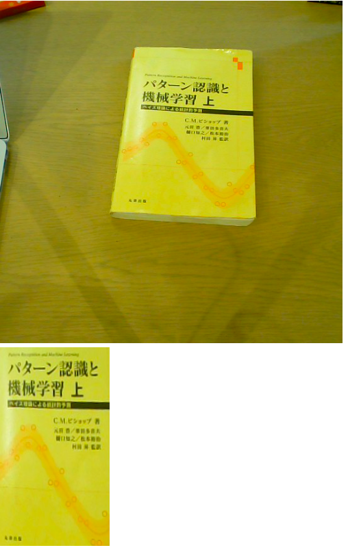
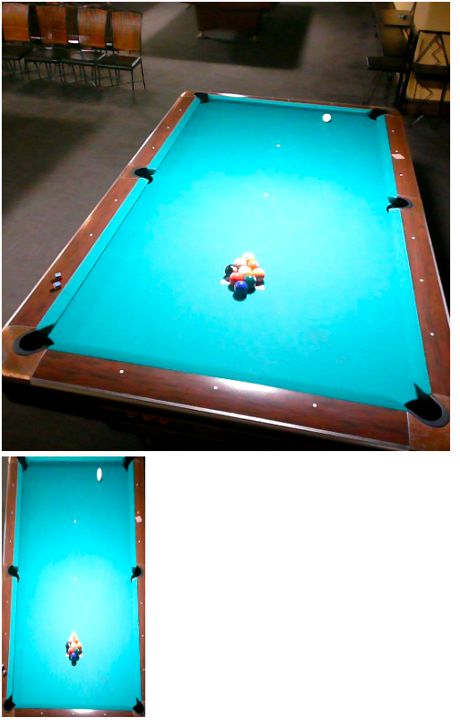
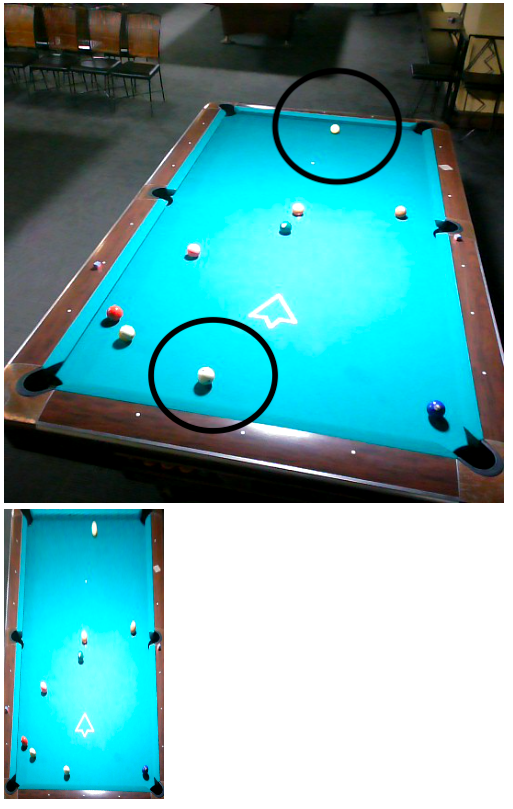
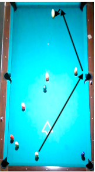

# 斜めから撮ったビリヤード台の画像を補正してハスラーをサポートする！

みんなでワイワイビリヤード中、狙いたい玉が隠れて困ってしまうことよくありますよね？上手く当てたいけどどこに撞いていいかわからない、こんな時に狙う場所を教えてくれるアプリがあったらなあ。

## 画像を加工して玉の配置を取得しよう！

ということで、今流行りのAIを使ってそんなアプリを作っていきましょう。ですが、どんなAIも玉の配置も見ずに最適解を出すことは難しいです。さらに、一般のビリヤード場で真上から撮影することは難しいので、うまいこと画像を処理する必要があります。

そこで今回は斜めから撮影した写真を真上から撮影した風な画像に変換するアプリ・デバイスを作りたいと思います。

## Jetson Nano

Jetson Nano。ちっちゃいけどGPUも積んでるすごいやつ。今回はこいつを使って、ビリヤード場で簡単に撮影→変換ができるようにすることが目標です。

<s>しかしこいつが使われることはなかった・・・</s>

- Jetson Nano  
(https://www.nvidia.com/ja-jp/autonomous-machines/embedded-systems/jetson-nano/)

## 実装したいもの(理想)

調べてみると、すぎゃーんさん(twitter:@sugyan)が矩形変換のアプリを作っていました。斜めから撮影された将棋盤を真上から撮影した風に変換しています。

OpenCVでの実装のようです。とてもサクサクしていて素敵ですね。

完成形のイメージには非常に近いです。

- 斜めに写った画像をCanvasで矩形に補正する  
(https://memo.sugyan.com/entry/2018/09/03/212712)

## 実装したもの(現実)

### 開発
+ TypeScript (3.5.3)
+ html5

せっかくなのでこの機会にTypeScriptに入門したいと思い、一般的な四角形から矩形への射影変換をTypeScriptで実装することにしました。愚直に書いたのでGPUを使えず3FPSくらいが限度になりそうかなーと思いつつ実装。式はこの辺りを参考にしました。

- E.2　二次元の射影変換[site]  
(http://kondolab.org/archive/2010/research/cadcgtext/ChapE/ChapE02.html)

ソースコードの全文はGithubに置いてあります。以下は変換後座標が変換前の座標のどこに対応するかを返す関数の実装です。本実装では矩形側のcanvasに1ピクセルごとに以下の関数を呼び出して元画像のピクセルをコピーしています。  

```typescript
function createProjection(
    tl: Point, //左上の座標
    tr: Point, //右上
    bl: Point, //左下
    br: Point, //右下
): (x: Point) => Point {
    // 射影変換の係数を求める
    const x2 = tr.x - tl.x;
    const y2 = tr.y - tl.y;
    const x3 = br.x - tl.x;
    const y3 = br.y - tl.y;
    const x4 = bl.x - tl.x;
    const y4 = bl.y - tl.y;

    const delta123 = x2 * y3 - x3 * y2;
    const delta124 = x2 * y4 - x4 * y2;
    const delta134 = x3 * y4 - x4 * y3;
    const delta1234 = delta123 + delta134;
    const delta234 = delta1234 - delta124;

    const a1 = delta134 * x2;
    const b1 = delta123 * x4;
    const a2 = delta134 * y2;
    const b2 = delta123 * y4;
    const a0 = delta134 - delta234;
    const b0 = delta123 - delta234;
    const c0 = delta234;
    return (p: Point) => new Point(
        (a1 * p.x + b1 * p.y) / (a0 * p.x + b0 * p.y + c0) + tl.x,
        (a2 * p.x + b2 * p.y) / (a0 * p.x + b0 * p.y + c0) + tl.y
    );
}
```

### 実証実験 in オフィス

ビリヤード場に行く前にPCで動作確認。射影変換が重すぎて0.5FPSくらいしか出ないことに気づきました。やはりきちんとGPUを使わないと厳しいですね。

オフィスにあって矩形に直すと嬉しそうなものを探すと適当な本があったので撮ってみました。結構綺麗に取れてますね。



### 実証実験 in ビリヤード場

いよいよJetsonだーとなったがモニター代わりにPCでリモートデスクトップすると演算がPCで走ることに気づきます。ビリヤード場で電源どうするんだ問題もあり愛用のMacを持ってビリヤード場に行きました。

ビリヤード場に着くと、カメラをセットする怪しげな一人客になってしまいました。お客さんがいない時間を狙って平日の朝にきて正解でした。



真上から撮れてる！！

玉の配置がどれくらい見えるのか確認のためブレイク(強く撞いて玉を散らばすこと)してみると、、、



真上からの画像が見れるようになったので配置がよくわかりますね。<s>4回目のブレイクで</s>たまたま1番が隠れてしまったので頑張って当ててみようと思います。(下の丸が手玉(白玉)、上の丸が1番)。

このまままっすぐ撞いてしまうと別の玉に当たってしまいます。ここは右側のクッション(壁)を使って当てていきましょう。ポケットと玉の間を通すと当たってくれそうです。



回転の影響を受けるとよくないので慎重に真ん中を撞きます、、、予想通り2クッションでしっかり当たりました！！  

基本的に入射角=反射角なので真上から見るとかなり正確に見積もれます。  

このように、斜めからの画像を真上からの画像に変換することで、玉が非常に衝きやすくなることがわかりました。
今回は実装できませんでしたが、この矢印が自動で出てくるようになったらとても嬉しいですね。 

## 終わりに
### 感想
フロントエンドはあまり得意ではなかったのですが、今回TypeScriptで開発することで結構わかるようになった気がします。TypeScriptの型は面白いですね、少し勉強してみようと思います。

せっかく純粋に近い関数を書いたのにテストを書いていないのは残念でした、次の機会ではきちんとテストも書けるようにしたいです。  

Jetson+カメラ+タッチディスプレイでモジュールが作れたら面白いなーと思いました。カメラスタンドがそもそも大きいので多少大きめディスプレイでも良いですね。

### できたこと

  + 射影変換を実装してブラウザでリアルタイムに調整・画像の取得ができるようになった。

### 課題・やりたいこと

  + 計算をCPUで回したらかなり動作が厳しくなった。今後はWebGLを利用した実装かOpenCVなどのそれ用のライブラリに乗っかるかなどして高速化したい。

  + UIの改善。CPUに余裕がなくグラフィカルなUIを提供できなかったが、もう少し簡単に操作できるようにしたい。

  + 玉の色がわかりづらいので玉を区別するのが難しい。色をくっきりさせるかポップアップで数値を表示できるようにしたい。

  + 画面の上部がやや引き伸ばされているように見える。玉が平面に描かれているのではなく、3Dの物体として存在するのでよくない補正が入ってしまっているためか。

  + 画像が取得できたので物体検出を利用して玉の配置を取得したい。

  + 玉の軌跡の予想を表示できるようにしたい。

  + 最適な撞き方を推薦してくれるようにしたい。

(pytran3)