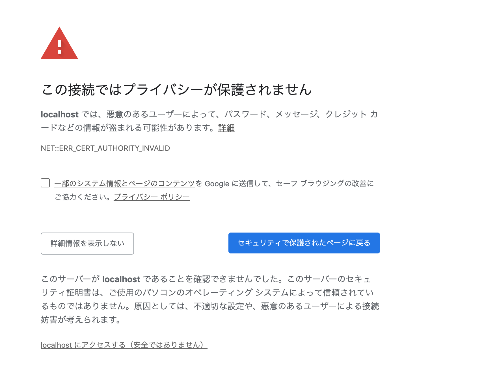
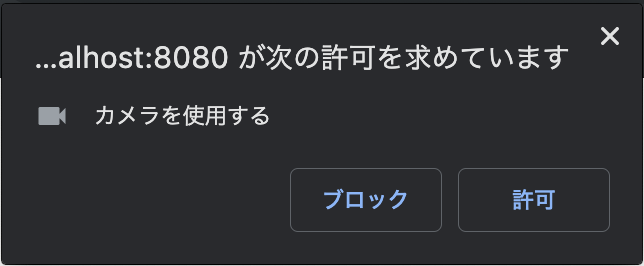
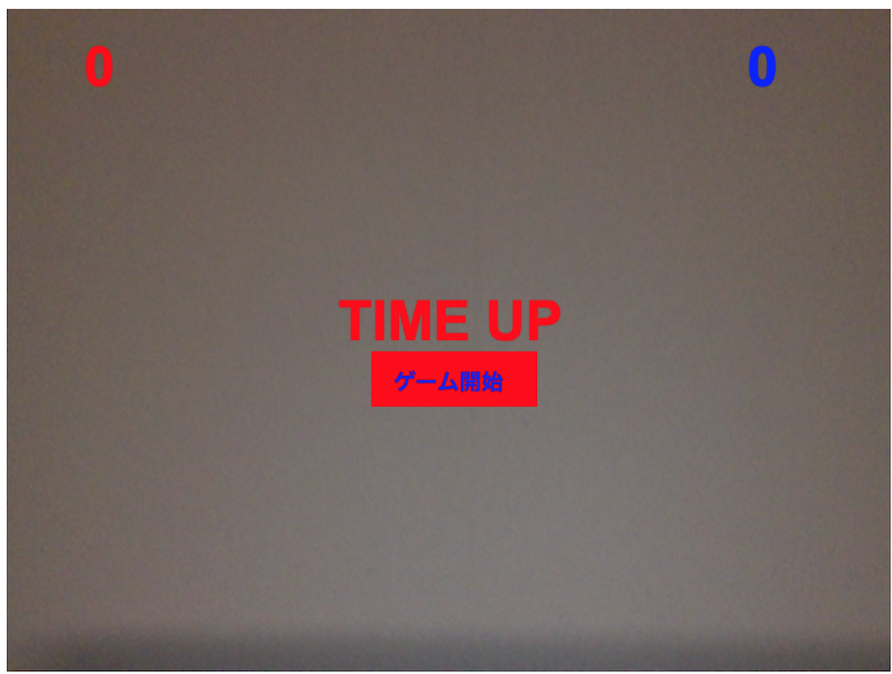

# カメラの中でいくつとれるかな？ゲーム
## はじめに  
カメラの中でいくつとれるかな？ゲームは、WebカメラとWebブラウザだけで手軽に遊べるジェスチャゲームです。  
落ちてくるお菓子を手でキャッチすると得点が得られます。  

このゲームのベースとなっているプログラム(https://github.com/gnavi-blog/posenet_sample)の詳細は、  
ぐるなびさんのテックブログ(https://developers.gnavi.co.jp/entry/posenet/hasegawa)で紹介されています。

posenet_sampleに以下のような機能を追加し、より遊びやすく・楽しいものに仕上げました。

- Webアプリ化
- 操作インタフェースの追加
- 効果音の追加
- 落ちてくるものをお菓子に変更

本書では、追加した機能について簡単に紹介します。  

また、このゲームは、Googleが開発している姿勢推定のJSライブラリ「PoseNet」を利用しているため、  
姿勢推定はクライアント側で処理されます。  
クライアントの性能によって、処理速度に差異が生じると考えられるので、いくつかの端末で性能比較をしました。

## アプリの起動
以下のコマンドを実行してください。
```
git clone git@github.com:staminajiro/shoten_7.git

cd shoten_7/src/GestureGame

docker build ./ -t gesturegame

docker run -p 8080:8080 gesturegame
```
無事起動できたら、(https://localhost:8080)にアクセスします。

以下の画面のように、プライバシーエラーが表示されたら、  
「詳細設定」→「localhostにアクセスする」をクリックしてください。



その後、カメラの使用を許可してください。



以下のような画面が表示されれば成功です。


右手、もしくは左手を画面中央のゲーム開始部分に持ってくると、
ゲームが開始します。

## Webアプリ化
posenet_sampleは、index.htmlのローカルファイルをブラウザで開くだけでゲームができるようになっています。  
更に手軽に遊べるように、Webアプリとして起動し、ブラウザでアクセするだけで遊べるように改良します。  

Webアプリのサーバー環境としてDockerを利用します。

注意として、WebブラウザからWebカメラにアクセスするためには、Webアプリはhttpsで配信している必要があるので、  
Dockerイメージビルド時に証明書を作成し、httpsでWebサーバーを起動するようにしています。

```Dockerfile
RUN openssl genrsa -out orekey.pem 1024 && \
    openssl req -new -key orekey.pem -subj "/C=JP/ST=Tokyo-to/L=Shibuya/O=Company Name/OU=IT dept./CN=Company Dept CA" > orekey.csr && \
    openssl x509 -req -in orekey.csr -signkey orekey.pem -out orekey.cert
```

Webサーバー起動時に、作成した証明書を参照するようにします。
```index.js
// 証明書のファイルを指定する
const options = { 
        key: fs.readFileSync('orekey.pem'),
        cert: fs.readFileSync('orekey.cert')
      };

var server = https.createServer(options,app);
```

## 操作インタフェースの追加
恥ずかしがらずに実際遊んでみると、大人でも結構楽しめます。
しかし、posenet_sampleは1回遊ぶと再読み込みが必要なため、
連続して遊べません。
何度でも連続して遊べるように、リトライ機能を追加します。

せっかく姿勢推定ができる状態ですので、マウス操作ではなく
身体を使ってゲームを開始できるようにします。

カメラの映像に姿勢推定の結果を重ね合わせているcanvasに、
「ゲーム開始」ボタンを配置します。
canvasに四角形を描画するfillRect()と文字列を表示するfillText()を使って、
「ゲーム開始」ボタン(のようなもの)を表現します。
```
ctx.fillRect(330,310,150,50);
ctx.font = "bold 20px Arial";
ctx.fillStyle = "blue";
ctx.fillText("ゲーム開始", 350, 345);
ctx.fill();
```

右手、もしくは左手が「ゲーム開始」ボタンと重なっているかどうかを、
PoseNetの姿勢推定の結果の座標と、「ゲーム開始」ボタンの座標を比較して、
判定します。

```
gameRestart([keypoints[9],keypoints[10]]);

function gameRestart(wrists){
    wrists.forEach((wrist) => {
    if((330 - 10)  <= wrist.position.x && wrist.position.x <= (480 + 10) &&
        (310 - 10) <= wrist.position.y && wrist.position.y <= (360+ 10)){
        balls = [];
        balls = initBalls(ballNum);
        score = 0;
        timeLimit = 50;
        printLimit = timeLimit / 10;
    }
    });
}
```
## 効果音の追加

取得時に効果音が流れるように

## 落ちてくるものをお菓子に変更

ボールからお菓子に

## 実行結果比較

ラズパイ　jetson GPD Pocket で比較

## さいごに
