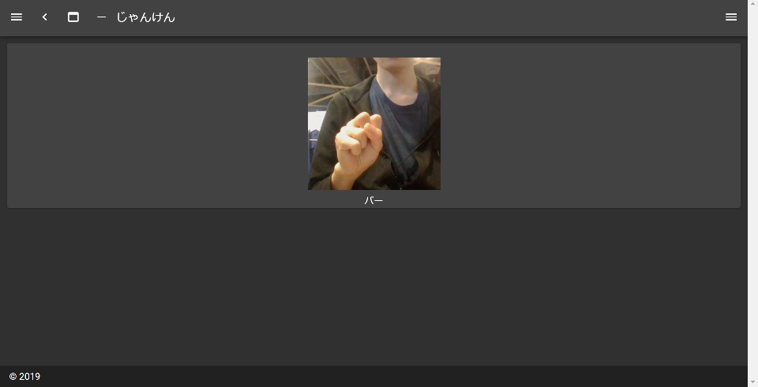

# webブラウザで動かすじゃんけん

## はじめに
本記事では、webブラウザ上でじゃんけんをするモデルを動かすことに挑戦してみました。
モデルの学習はGoogle Colabで行い、
Nuxt.js, TensorFlow.jsを使ってwebアプリを作成しました。
ブラウザはChromeを使用しています。

## モデルの作成
Google Colab上でモデルを作成します。
[TensorFlowのチュートリアル](https://www.tensorflow.org/tutorials/images/transfer\_learning)を参考にしました。
また、データは[からあげさんのデータセット](https://github.com/karaage0703/janken_dataset)を使用させていただきました。

```
!git clone https://github.com/karaage0703/janken_dataset data
data_dir = '/content/data'
!rm -rf /content/data/.git
```

でデータをColab上にデータをダウンロードしたあと、
以下のようにしてデータを入力するための準備をします。

```python
image_size = 224
batch_size = 32

data_gen = keras.preprocessing.image.ImageDataGenerator(
    preprocessing_function=keras.applications.mobilenet.preprocess_input,
    rotation_range=10,
    width_shift_range=0.2,
    height_shift_range=0.2,
    shear_range=0.2,
    zoom_range=0.3,
    horizontal_flip=True,
    validation_split=0.1
)

train_data = data_gen.flow_from_directory(
    data_dir,
    target_size=(image_size, image_size),
    batch_size=batch_size,
    subset='training'
)

val_data = data_gen.flow_from_directory(
    data_dir,
    target_size=(image_size, image_size),
    batch_size=batch_size,
    subset='validation'
)
```

チュートリアルを参考にモデルの作成・コンパイル・訓練を行いました。
以下のようなモデルを作成しました。

```python
model.summary()
```

```:output
Model: "sequential"
_________________________________________________________________
Layer (type)                 Output Shape              Param #   
=================================================================
mobilenetv2_1.00_224 (Model) (None, 7, 7, 1280)        2257984   
_________________________________________________________________
global_average_pooling2d (Gl (None, 1280)              0         
_________________________________________________________________
dense (Dense)                (None, 256)               327936    
_________________________________________________________________
dropout (Dropout)            (None, 256)               0         
_________________________________________________________________
dense_1 (Dense)              (None, 64)                16448     
_________________________________________________________________
dropout_1 (Dropout)          (None, 64)                0         
_________________________________________________________________
dense_2 (Dense)              (None, 3)                 195       
=================================================================
Total params: 2,602,563
Trainable params: 344,579
Non-trainable params: 2,257,984
_________________________________________________________________
```

以上のモデルをTensorFlow.jsで動かすために、モデルをTensorFlow.jsように変換してから保存します。
最新のバージョンのtensorflowjsではうまくいかなかったので(2019/09/14現在)、
バージョンを指定してインストールしてください。

```
!pip install tensorflowjs==1.2.6
import tensorflowjs as tfjs
tfjs.converters.save_keras_model(model, save_dir)
```

保存したデータはローカルにダウンロードします。

## webアプリの作成
### ライブラリのインストール
node.jsをインストールし、
[nuxt.jsのガイド](https://ja.nuxtjs.org/guide/installation/)を参考にwebアプリを作成します。

```powershell
npx create-nuxt-app <project-name>
```

を実行したあと、いくつか質問されます。
UIフレームワークとしてVuetifyを選択します。
フレームワークの選択が終了したら、

```
cd <project-name>
npm install @tensorflow/tfjs @tensorflow/tfjs-data
```

を実行します。

### ウェブカメラ

componentsフォルダ内にウェブカメラの映像を表示するコンポーネントWebCamera.vueを作成します。

```:WebCamera.vue
<template>
  <video ref="video" height="224" width="224" autoplay></video>
</template>

<script>
export default {
  data() {
    return {
      video: null
    }
  },
  mounted() {
    this.stream()
  },
  methods: {
    stream() {
      this.video = this.$refs.video
      navigator.mediaDevices
        .getUserMedia({ video: true, audio: false })
        .then((stream) => {
          this.video.srcObject = stream
        })
    }
  }
}
</script>
```

MediaDevices.getUserMedia()メソッドはEdgeでは未対応らしいので、
Edgeなどのブラウザを利用している場合はWebCamera.vueを変更する必要があると思います。

### TensorFlow.js
pagesフォルダ内のindex.vueを以下のように変更します。

```:index.vue
<template>
  <v-layout column justify-center>
    <v-flex xs12 sm8 md6 text-center>
      <v-card>
        <v-card-title class="align-center"></v-card-title>
        <web-cam ref="webcam" />
        <div>
          {{ labels[(pred + 1) % 3] }}
        </div>
      </v-card>
    </v-flex>
  </v-layout>
</template>

<script>
import * as tf from '@tensorflow/tfjs'
import * as tfd from '@tensorflow/tfjs-data'
import WebCam from '../components/WebCam.vue'

export default {
  components: {
    WebCam
  },
  data() {
    return {
      labels: ['チョキ', 'グー', 'パー'],
      probs: [1, 0, 0],
      pred: ''
    }
  },
  mounted() {
    Promise.all([this.setupCamera(), this.loadModel()]).then(
      setInterval(this.predict, 200)
    )
  },
  methods: {
    async setupCamera() {
      this.cam = await tfd.webcam(this.$refs.webcam.video)
    },
    async loadModel() {
      this.model = await tf.loadLayersModel('/model/model.json')
    },
    async predict() {
      let img = await this.cam.capture()
      // スケーリング
      img = img.div(tf.scalar(127.5)).sub(tf.scalar(1))
      this.probs = await this.model.predict(img.expandDims(0)).data()
      this.a = img
      this.pred = this.argmax(this.probs)
    },
    argmax(arr) {
      let idx = 0
      let val = -Infinity
      for (const [i, v] of arr.entries()) {
        if (val < v) {
          idx = i
          val = v
        }
      }
      return idx
    }
  }
}
</script>
```

Google Colabで作成したモデルはstiacフォルダにダウンロードしており、
loadModel()で読み込んでいます。

モデルの訓練時に入力したデータに
preprocessing_functionを設定したと思います。
preprocess_input内では[-1, 1]にスケーリングしているようなので、
カメラから取得した画像にも

```
img = img.div(tf.scalar(127.5)).sub(tf.scalar(1))
```

としてスケーリングします。

predict()はmodelの予測した確率から、カメラに写っている手を予測し番号で返します。
チョキ: 0, グー: 1, パー:2です。

```
{{ labels[(pred + 1) % 3] }}
```

で出された手に勝つ手を表示します。



## おわりに
あまり精度はよくないですが、じゃんけんを行う簡単なアプリを作ることができました。
今後の改善として、
- モデルの精度の向上
- グー、チョキ、パーをテキストではなく画像で表示
を行っていきたいです。

## 参考文献
- https://www.tensorflow.org/tutorials/images/transfer_learning
- https://github.com/karaage0703/janken_dataset
- https://ja.nuxtjs.org/guide/installation/

(sito65536)