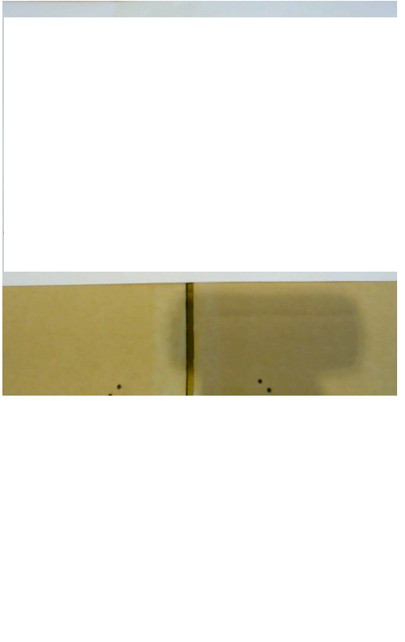

# 斜めから撮ったビリヤード台の画像を補正してハスラーをサポートする！

みんなでワイワイビリヤード中、狙いたい玉が隠れて困ってしまうことよくありますよね？上手く当てたいけどどこに撞いていいかわからない、こんな時に狙う場所を教えてくれるアプリがあったらなあ。

## 画像を加工して玉の配置を取得しよう！

どんなAIも玉の配置も見ずに最適解を出すのは難しいです。しかし一般のビリヤード場で真上から撮影することは難しいので、うまいこと画像を処理する必要があります。

そこで今回は斜めから撮った写真を真上から撮った風な画像に変換するアプリ・デバイスを作りたいと思います。

## Jetson Nano

ちっちゃいけどGPUも積んでるすごいやつ。今回はこいつでビリヤード場で簡単に撮影→変換ができるようにしてみたいです。

<s>しかしこいつが使われることはなかった・・・</s>

[Jetson Nano](https://www.nvidia.com/ja-jp/autonomous-machines/embedded-systems/jetson-nano/)

## 実装したいもの(理想)

すぎゃーんさん(twitter:@sugyan)が矩形変換のアプリを作っていました。

OpenCVでの実装のようです。とてもサクサクしていて素敵ですね。

完成形のイメージには非常に近いです。

[斜めに写った画像をCanvasで矩形に補正する](https://memo.sugyan.com/entry/2018/09/03/212712)

## 実装したもの(現実)

### 開発

せっかくなのでこの機会にTypeScriptに入門したいと思ったので、一般的な四角形から矩形への射影変換をTypeScriptで実装することにしました。愚直に書いたのでGPUを使えず3FPSくらいが限度になりそうかなーと思いつつ実装。式はこの辺りを参考にしました。

[E.2　二次元の射影変換](http://kondolab.org/archive/2010/research/cadcgtext/ChapE/ChapE02.html)

ソースコードの全文はGithubに置いてあります。以下は変換後座標が変換前の座標のどこに対応するかを返す関数の実装です。  

```typescript
function createProjection(
    tl: Point, //左上の座標
    tr: Point, //右上
    bl: Point, //左下
    br: Point, //右下
): (x: Point) => Point {
    // 射影変換の係数を求める
    // http://kondolab.org/archive/2010/research/cadcgtext/ChapE/ChapE02.html
    const x2 = tr.x - tl.x;
    const y2 = tr.y - tl.y;
    const x3 = br.x - tl.x;
    const y3 = br.y - tl.y;
    const x4 = bl.x - tl.x;
    const y4 = bl.y - tl.y;

    const delta123 = x2 * y3 - x3 * y2;
    const delta124 = x2 * y4 - x4 * y2;
    const delta134 = x3 * y4 - x4 * y3;
    const delta1234 = delta123 + delta134;
    const delta234 = delta1234 - delta124;

    const a1 = delta134 * x2;
    const b1 = delta123 * x4;
    const a2 = delta134 * y2;
    const b2 = delta123 * y4;
    const a0 = delta134 - delta234;
    const b0 = delta123 - delta234;
    const c0 = delta234;
    return (p: Point) => new Point(
        (a1 * p.x + b1 * p.y) / (a0 * p.x + b0 * p.y + c0) + tl.x,
        (a2 * p.x + b2 * p.y) / (a0 * p.x + b0 * p.y + c0) + tl.y
    );
}
```

### 実証実験 in Office

ビリヤード場に行く前にPCで動作確認。射影変換が重すぎて0.5FPSくらいしか出ないことに気づきました。やはりきちんとGPUを使わないと厳しいですね。

オフィスにあって矩形に直すと嬉しそうなものを探すと適当な本があったので撮ってみました。結構綺麗に取れてますね。(幻覚)



### 実証実験 in ビリヤード場

いよいよJetsonだーとなったがモニター代わりにPCでリモートデスクトップすると演算がPCで走ることに気づきます。ビリヤード場で電源どうするんだ問題もあり愛用のMacを持ってビリヤード場に行きました。


カメラをセットする怪しげな一人客になっています。流石にまずいと思ったのでお客さんがいない時間を狙って平日の昼間にきて正解でした。


真上から見れてる！！(幻覚)

玉の配置がどれくらい見えるのか確認のためブレイク(強く撞いて玉を散らばすこと)してみると


真上からの画像が見れるようになったので被ってるのがよくわかりますね。<s>n回目のブレイクで</s>たまたま1番が隠れてしまったので頑張って当ててみようと思います。


回転の影響を受けるとよくないので慎重に真ん中を撞きます。。。ちゃんと当たりました(妄想)

## 終わりに

* できたこと

  + 射影変換を実装してブラウザでリアルタイムに調整・画像の取得ができるようになった。

* 課題・やりたいこと

  + 計算をCPUで回したらかなり動作が厳しくなった。今後はWebGLを利用した実装かOpenCVなどのそれ用のライブラリに乗っかるかなどして高速化したい。

  + UIの改善。CPUに余裕がなくグラフィカルなUIを提供できなかったが、もう少し簡単に操作できるようにしたい。

  + [多分画像が歪んでて辛いのでそれに関するコメントを書く]

  + 画像が取得できたので物体検出を利用して玉の配置を取得する

  + 台の状態がわかったら玉の軌跡みたいなのを表示したい
