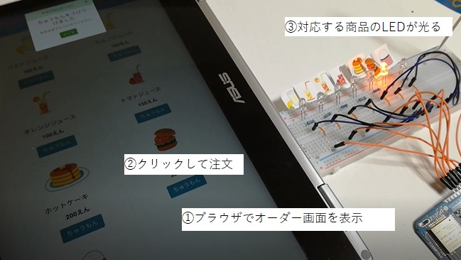
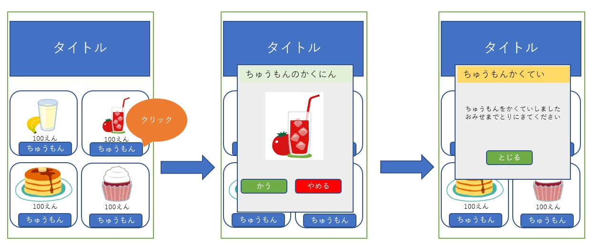
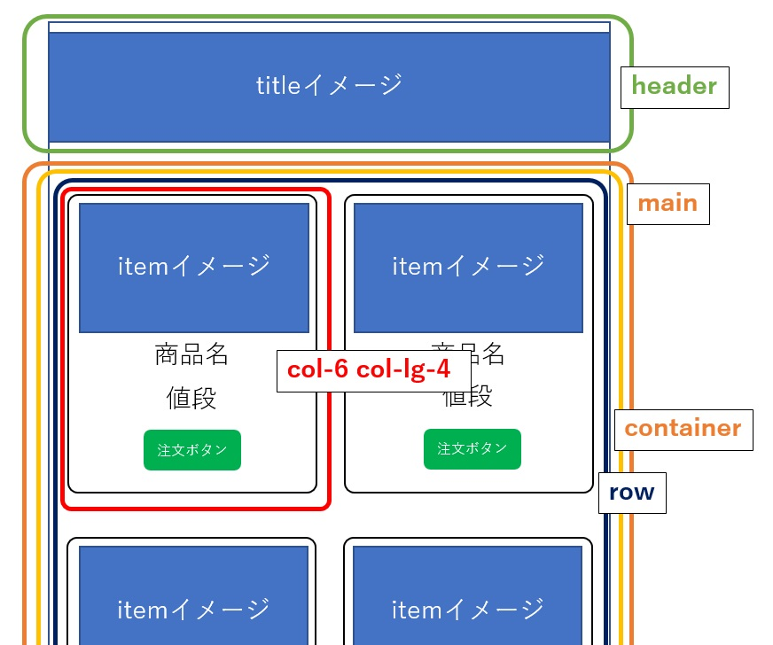
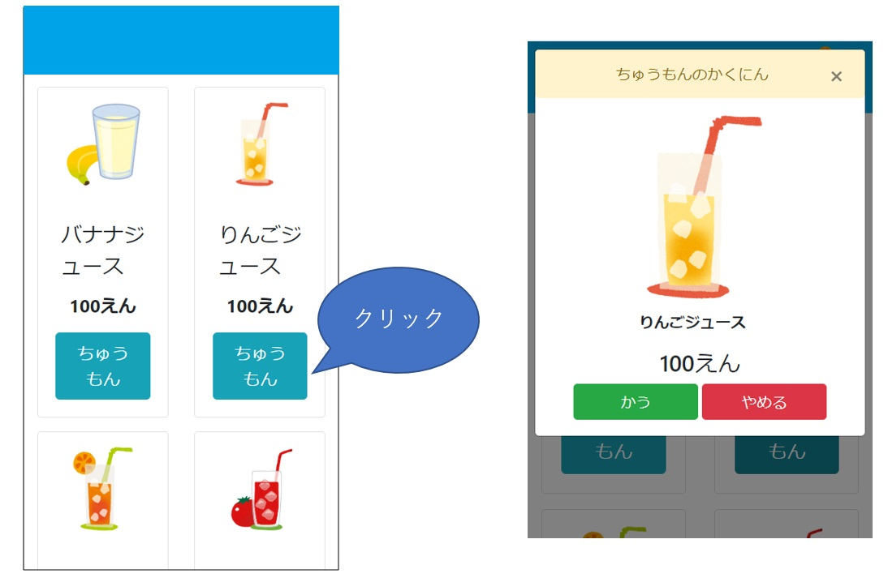
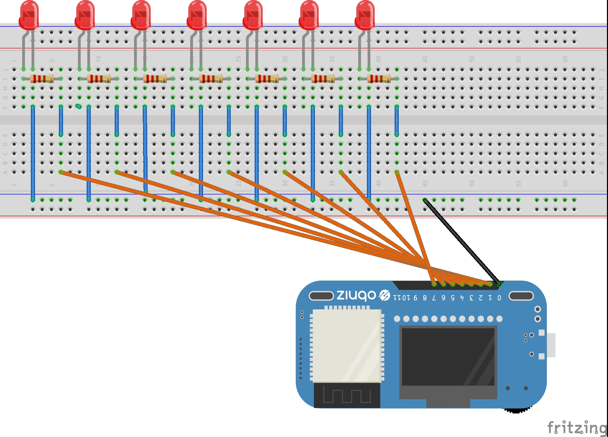

# obnizとFirebaseを使ってモバイルオーダーシステムをつくる
## はじめに
最近スマホで事前に注文してお店についたら注文した商品がすでにできあがっているという、モバイルオーダーのシステムを導入しているお店が増えています。
とっても便利なシステムですよね。ところで子供ってお店屋さんごっこって大好きですよね？うちの娘もいつもお店屋さんごっこで遊んでいるのですが、このお店屋さんごっこにモバイルオーダーのシステムを導入したら面白いんじゃない？という発想から簡単なモバイルオーダーのシステムを作ってみました。

## 作るもの
最終的に以下のようなものを作ります。

(モバイルオーダーの流れ)  

子供が分かりやすいように、注文が来たらピカピカLEDが光るようにしました。それ以外にも、例えばサーボモーターで旗をあげる、スピーカーから音を鳴らす、などでも面白そうです。

## 大まかな構成
Bootstrap・Vue.jsを使ってフロントを開発し、GoogleのFirebaseでアプリケーションを公開します。最後にLEDを光らせるところはIoTデバイスのobnizを活用しました。

## フロントの開発
### アプリケーションの動作の流れ
アプリケーションの動作は、以下のようにしました。

### Bootstrap
画面のデザインはCSSのフレームワークBootstrapを使用しました。Bootstrapでは画面の横幅を12個の格子(グリッド)で区切り、各コンテンツに12個のグリッドのうち 何個のグリッドを割り当てるかで画面デザインを行う、グリッドデザインが採用されています。また表示する画面のサイズによりレスポンシブルにグリッドの割当を変更することもできます。以下のように設定することで画面の横幅がlg以上(721px以上)の場合は横に3つの商品が並び、それ以外の時は横に2つの商品が並ぶデザインになります。

### Vue.js
動的に画面の表示を変えるため、JavascriptのフレームワークVue.jsを使用しました。まず以下のように表示するアイテムのマスタを定義します。
```javascript
const products = [
    {name:"バナナジュース　",price:100,img:"./img/banana_juice.png"},
    {name:"りんごジュース　",price:100,img:"./img/apple_juice.png"},
    {name:"オレンジジュース",price:100,img:"./img/orange_juice.png"},
    {name:"トマトジュース　",price:150,img:"./img/tomato_juice.png"},
    {name:"ホットケーキ　　",price:200,img:"./img/pancake.png"},
    {name:"ハンバーガー　　",price:300,img:"./img/hamburger.png"},
    {name:"カップケーキ　　",price:200,img:"./img/cupcake.png"}
];
```
次にこの商品マスタの情報をVue.jsのv-forディレクティブを使ってリストに表示させます。
```javascript
<div class="col-6 col-lg-4 mb-3" v-for="(prod,index) in products">
  <div class="card text-center h-100">
    <div></div>
    <div class="card-body text-center">
      <div class="card-title">{{ prod.name }}</div>
      <div class="card-text mb-3">{{ prod.price }}えん</div>
      <button type="button" v-on:click="onOrder(index)" class="btn btn-lg btn-info" data-toggle="modal" data-target="#order-modal">ちゅうもん</button>
    </div>
  </div>
</div>
```
ちゅうもんボタンを押したときに呼び出される関数onOrderは以下のように定義しています。

```javascript
onOrder:function(index){
  this.selected = this.products[index]
}
```
Bootstrapのmodalとのあわせ技で、これでちゅうもんボタンを押されたときに対応する商品の情報がモーダルで表示されます。


## アプリケーションの公開
### Firebase
GoogleのクラウドサービスFirebaseを利用してアプリケーションを公開し、任意のブラウザから利用できるようにします。

### Firebaseプロジェクトの作成
Webアプリを作成するためにまずFirebaseプロジェクトを作成します。
Firebaseのサイトからコンソールに移動します。Googleのアカウントの選択を求められるので、使用するアカウントを選択します。
コンソールが表示されたら、[プロジェクトの作成]ボタンをクリックします。プロジェクト名やGoogleアナリティクスを利用する場合はその設定など入力すると、プロジェクトが出来上がります。
### Firebase CLIのセッティング
ローカルで作成したアプリをFirebaseにデプロイするためにFirebase CLI(コマンドラインインターフェース)というツールが必要になります。
Firebase CLIにはNode.jsとnpmが必要なので、事前にインストールしておきます。

Firebase CLIのインストールが完了したら、コマンドラインを立ち上げて以下のコマンドでログインします。
```terminal
$ firebase login
```
するとブラウザでGoogleアカウントの選択が求められるので、ログインするアカウントを選択してログインします。

次にローカルにFirebaseプロジェクトと紐づけをするディレクトリを作成します。(mobileorder-appという名前にしました。)
```terminal
$ mobileorder-app
$ firebase init
```
すると対話形式で色々聞いてくるので一つ一つ入力していき設定を完了させます。

### デプロイ
initコマンドを実行したディレクトリを見ると、index.htmlなどのファイルが生成されていると思います。ディレクトリにWebアプリに必要なファイルを配置していきます。配置が完了したら、クラウドにデプロイして公開します。mobileorder-appディレクトリで以下のコマンドを実行します。
```terminal
$ firebase deploy
```

うまくいけば表示されるメッセージの最後にURLが表示されますので、スマホなどのブラウザでこのURLにアクセスすればアプリケーションを表示させることができます。

## アプリケーションと連動してLEDを光らせる
いよいよアプリケーション側の注文を受けてLEDを光らせる部分を作っていきます。ネットワークに接続できるデバイスは色々ありますが、システムに組み込むためのハードルが低いobnizというデバイスを利用します。
### obniz
IoTのシステムを構築する場合、デバイスだけでなくデバイスを制御するサーバーを準備したり、サーバーとデバイス間の通信をどうするかといったことも考慮する必要がありますが、obnizの場合はデバイスを制御するサーバーとデバイスとサーバーの通信がすでに整備されているため、すぐにIoTのシステムを作ることができるのが大きな魅力です。
### obnizとLEDの配線
以下のように配線しました。


obnizには計12個のpinが用意されています。0番pinをGND、1番～7番pinが出力用でプログラムでコントロールします。抵抗付きのLEDだと抵抗はいらないそうですが、手持ちのLEDは抵抗が付いていなかったため、抵抗も入れました。
### LEDを制御するプログラム
obnizはクラウドAPIでpinをコントロールすることができます。目標は注文を受けたらその商品に対応するLEDを0.5秒間隔で10回チカチカさせることです。APIに以下のようなリクエストを投げることで1番pinにつながっているLEDをピカピカさせられます。
```javascript
[
    {
        "io": {
            "animation": {
                "name": "animation-1",
                "status": "loop",
                "repeat": 10,
                "states": [
                    {
                        "duration": 500,
                        "state": {"io0":false,"io1":true}
                    },
                    {
                       "duration": 500,
                       "state": {"io1":false}
                    }
                ]
            }
        }
    }
]
```
repeatで繰り返し回数、durationで点灯時間、stateで対象のpinとon/ofの状態を指定しています。つまり"io1"の部分を注文された商品に合わせて動的に変化させれば対応するLEDをピカピカさせられる、というわけです。

Webアプリケーションのjavascriptファイルに処理を追加していきます。 まず商品マスタに新たにioという配列のプロパティを設定しました。
```javascript
const products = [
    {name:"バナナジュース　",price:100,img:"./img/banana_juice.png",io:[{"io0":false,"io1":true},{"io1":false}]},
    {name:"りんごジュース　",price:100,img:"./img/apple_juice.png",io:[{"io0":false,"io2":true},{"io2":false}]},
    {name:"オレンジジュース",price:100,img:"./img/orange_juice.png",io:[{"io0":false,"io3":true},{"io3":false}]},
    {name:"トマトジュース　",price:150,img:"./img/tomato_juice.png",io:[{"io0":false,"io4":true},{"io4":false}]},
    {name:"ホットケーキ　　",price:200,img:"./img/pancake.png",io:[{"io0":false,"io5":true},{"io5":false}]},
    {name:"ハンバーガー　　",price:300,img:"./img/hamburger.png",io:[{"io0":false,"io6":true},{"io6":false}]},
    {name:"カップケーキ　　",price:200,img:"./img/cupcake.png",io:[{"io0":false,"io7":true},{"io7":false}]}
];
```
そして注文確定の際に呼ばれる関数を以下のようにします。
```javascript
fixOrder:function(){
    var io = this.selected.io;
    var obnizid = "xxxx-xxxx";
    var data = [{
        "io": {
            "animation": {
                "name": "animation-1",
                "status": "loop",
                "repeat": 10,
                "states": [
                    {
                        "duration": 500,
                        "state": io[0]
                    },
                    {
                        "duration": 500,
                        "state": io[1]
                    }
                 ]
            }
        }
    }]
    console.log(data["io"]);
    console.log(axios.post("https://obniz.io/obniz/"+ obnizid +"/api/1",data));
    $('#order-fix-modal').modal('show');
}
```
これで注文を受けたときに対応するLEDを光らせることができるようになりました。
